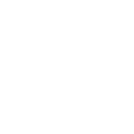

<p align="center">
<h1>MicroBin</h1>

</p>

MicroBin — это легковесное и простое приложение для Windows, которое отображает состояние вашей корзины прямо в системном трее. Оно позволяет вам с одного взгляда увидеть, пуста ли корзина или в ней есть файлы, и предоставляет быстрый доступ к ее основным функциям.

<p>
<h2>🌟 Возможности</h2>

Моментальное отображение статуса: Иконка в трее меняется в зависимости от того, есть ли в корзине файлы.

Две темы: Поддержка светлой и темной тем, чтобы соответствовать вашей операционной системе.

Быстрые действия: Через контекстное меню вы можете одним кликом открыть или очистить корзину.

Настраиваемый интервал проверки: Вы можете изменить, как часто приложение проверяет состояние корзины.

Минималистичный дизайн: Приложение не мешает работе и использует минимум системных ресурсов.

<h2>📸 Скриншоты</h2>


<p align="center">
<h3>Светлая тема</h3>



<h3>Темная тема</h3>


</p>

<h2>⚙️ Установка</h2>

<h3>Через Releases (рекомендуемый способ)</h3>

1. Перейдите на страницу Releases.
2. Загрузите последний исполняемый файл .exe для Windows (например, MicroBin.exe).
3. Запустите файл. Приложение будет работать в фоновом режиме, а его иконка появится в системном трее.

<h3>Из исходного кода</h3>

Если вы хотите запустить приложение из исходного кода, выполните следующие шаги:

1. Клонируйте репозиторий:
```Bash
git clone https://github.com/fantommripper/MicroBin
cd MicroBin
```
2. Установите необходимые библиотеки. Создайте файл requirements.txt в корне проекта и добавьте в негоследующие строки:
```
pystray
Pillow
winshell
```
3. Затем установите их с помощью pip:
```Bash
pip install -r requirements.txt
```
4. Запустите приложение:
```Bash
python main.py
```

<h2>🛠️ Настройки</h2>

Приложение создает файл config.json в папке %APPDATA%/MicroBin. Вы можете настроить его напрямую или использовать меню приложения.

<p align="center">

</p>

Вы можете изменить:

1. Тему: "Светлая" или "Темная".
2. Интервал проверки: Частота обновления статуса корзины (в секундах).

<h2>🤝 Вклад в проект</h2>

Буду рад любым улучшениям и предложениям! Если вы хотите помочь, пожалуйста, следуйте этим шагам:

1. Сделайте форк проекта.1. 
2. Создайте свою ветку для новой фичи (git checkout -b feature/AmazingFeature).1. 
3. Закоммитьте изменения (git commit -m 'Add some AmazingFeature').1. 
4. Отправьте изменения в вашу ветку (git push origin feature/AmazingFeature).1. 
5. Откройте pull request.

<h2>📄 Лицензия</h2>

Распространяется под лицензией MIT. Дополнительную информацию смотрите в файле LICENSE.

<h2>🙏 Благодарности</h2>

    pystray для иконки в системном трее.

    Pillow для работы с изображениями.

    winshell для работы с Корзиной Windows.

</p>