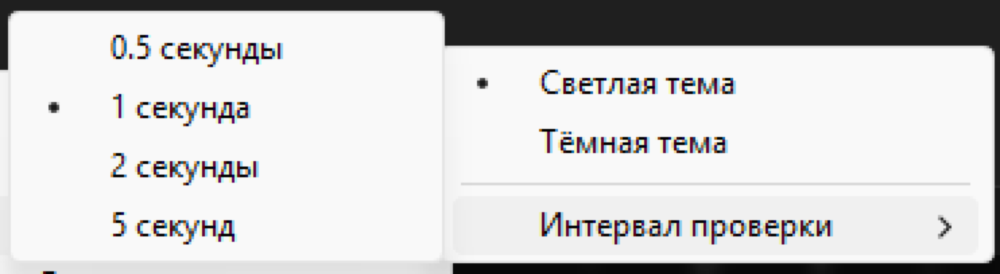

<p align="center">
<h1>MicroBin<s/h1>

</p>

MicroBin — это легковесное и простое приложение для Windows, которое отображает состояние вашей корзины прямо в системном трее. Оно позволяет вам с одного взгляда увидеть, пуста ли корзина или в ней есть файлы, и предоставляет быстрый доступ к ее основным функциям.

<p>
<h2>🌟 Возможности</h2>

Моментальное отображение статуса: Иконка в трее меняется в зависимости от того, есть ли в корзине файлы.

Две темы: Поддержка светлой и темной тем, чтобы соответствовать вашей операционной системе.

Быстрые действия: Через контекстное меню вы можете одним кликом открыть или очистить корзину.

Настраиваемый интервал проверки: Вы можете изменить, как часто приложение проверяет состояние корзины.

Минималистичный дизайн: Приложение не мешает работе и использует минимум системных ресурсов.
</p>
📸 Скриншоты

Здесь вставьте изображения.

<p align="center">
<h3>Светлая тема</h3>


<h3>Темная тема</h3>


</p>

⚙️ Установка

Через Releases (рекомендуемый способ)

    Перейдите на страницу Releases.

    Загрузите последний исполняемый файл .exe для Windows (например, MicroBin.exe).

    Запустите файл. Приложение будет работать в фоновом режиме, а его иконка появится в системном трее.

Из исходного кода

Если вы хотите запустить приложение из исходного кода, выполните следующие шаги:

    Клонируйте репозиторий:

    ```Bash
    git clone https://github.com/ваш_пользователь/MicroBin.git
    cd MicroBin
    ```

    Установите необходимые библиотеки. Создайте файл requirements.txt в корне проекта и добавьте в него следующие строки:
    ```
    pystray
    Pillow
    winshell
    ```
    Затем установите их с помощью pip:

    ```Bash
    pip install -r requirements.txt
    ```

    Запустите приложение:
    ```Bash
    python main.py
    ```

🛠️ Настройки

Приложение создает файл config.json в папке %APPDATA%/MicroBin. Вы можете настроить его напрямую или использовать меню приложения.

<p align="center">

</p>

Вы можете изменить:

    Тему: "Светлая" или "Темная".

    Интервал проверки: Частота обновления статуса корзины (в секундах).

🤝 Вклад в проект

Буду рад любым улучшениям и предложениям! Если вы хотите помочь, пожалуйста, следуйте этим шагам:

    Сделайте форк проекта.

    Создайте свою ветку для новой фичи (git checkout -b feature/AmazingFeature).

    Закоммитьте изменения (git commit -m 'Add some AmazingFeature').

    Отправьте изменения в вашу ветку (git push origin feature/AmazingFeature).

    Откройте pull request.

📄 Лицензия

Распространяется под лицензией MIT. Дополнительную информацию смотрите в файле LICENSE.

🙏 Благодарности

    pystray для иконки в системном трее.

    Pillow для работы с изображениями.

    winshell для работы с Корзиной Windows.

